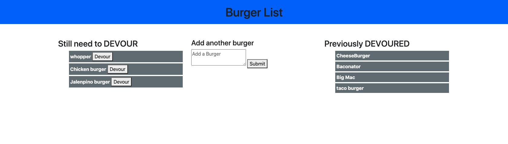

# Burger List

  ## Description
    This project uses node, mysql, express and handlebars to vreate an app that allows user to add burgers they wish to eat to a list. They can then press the DEVOUR button to move a specifc burger to the eaten list. This app uses a hand created ORM to read, crete and update insdide the mysql database. It is able to run through node and be viewed on a local host as well as is deployed to Heroku at https://still-beach-73988.herokuapp.com/

  ## Table of Contents

  *[Installation](#installation)

  *[Usage](#usage)

  *[Contributing](#contributing)

  *[Tests](#tests)

  *[Questions](#questions)

  ## Installation
  npm i

  ## Usage
  You can visit the Heroku url or run node server

  ## Contributing
  contact me

  ## Tests
  no active testing 

  ## Questions
  tbond4
  tristanebond@gmail.com
  
